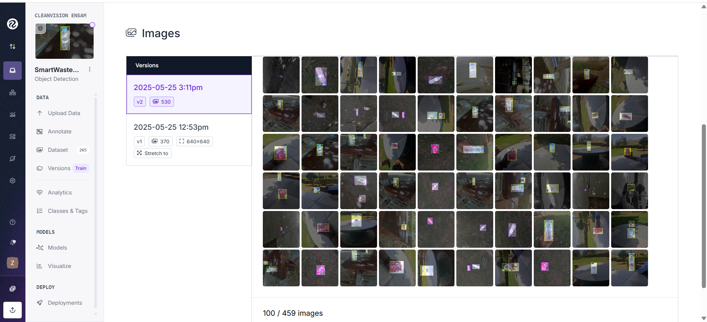
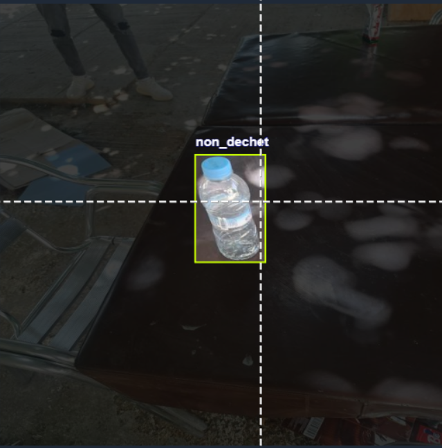
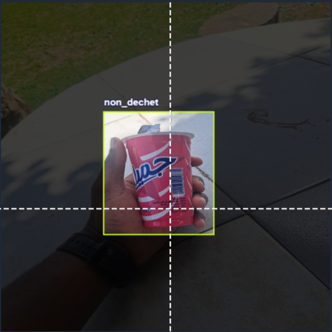
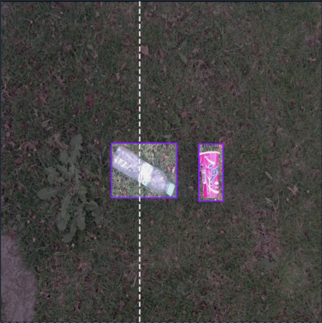
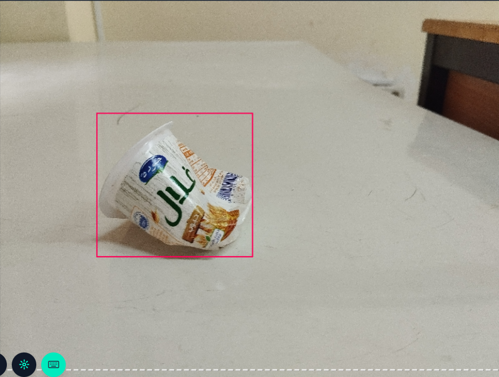
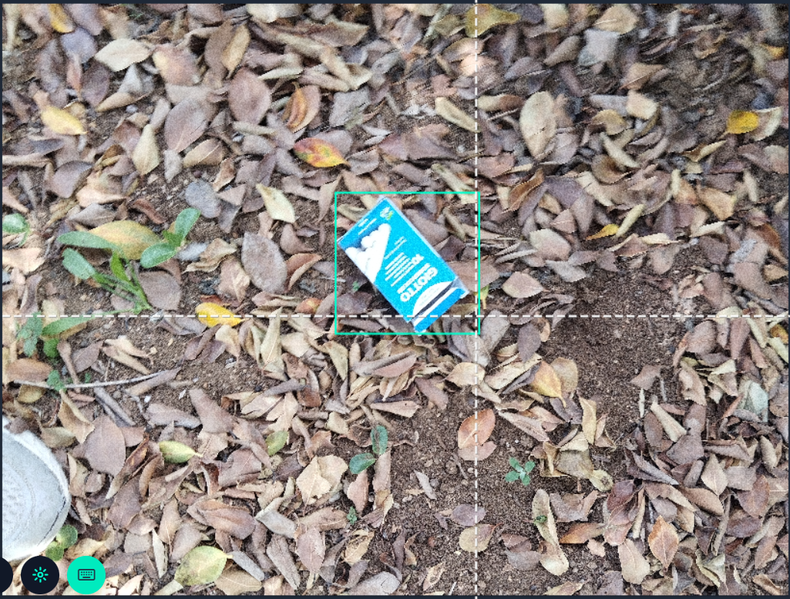
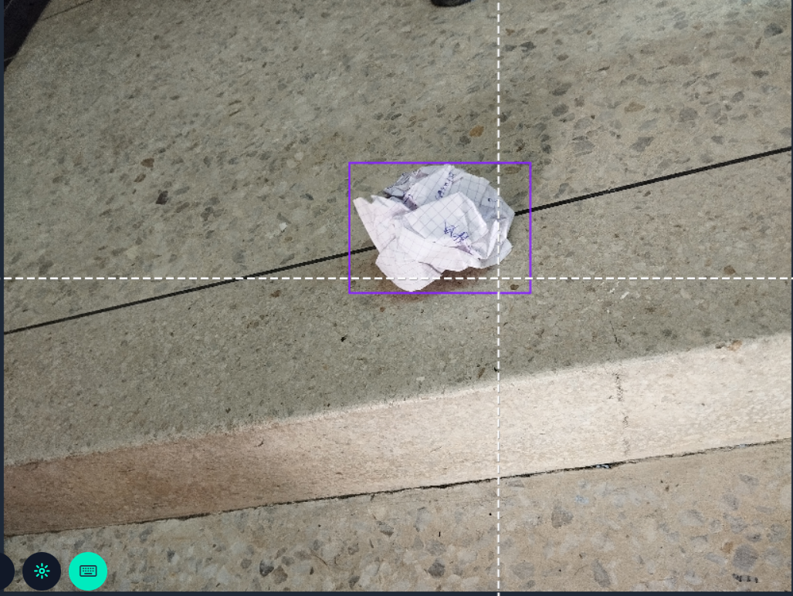
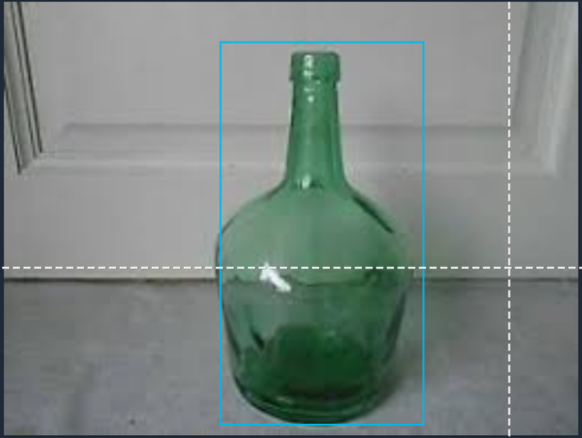
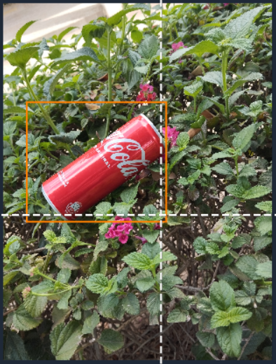

Explication générale du projet
==============================

Ce projet de vision par ordinateur a pour objectif de **détecter automatiquement les déchets** dans des images et de **classer ces déchets** selon leur type. Il s'appuie sur l'intelligence artificielle et l'apprentissage profond pour contribuer à la **préservation de l'environnement** et à l'amélioration de la **gestion des déchets**.

Le système utilise deux modèles YOLOv8 (You Only Look Once version 8) entraînés indépendamment :

1. **Modèle de détection** : Détermine si un objet constitue un déchet ou non selon le contexte
2. **Modèle de classification** : Catégorise le type de déchet détecté parmi 5 classes principales

Cette approche en deux étapes permet d'obtenir une **précision élevée** et une **classification contextuelle intelligente**.

Contexte et motivation
----------------------

La gestion des déchets représente un enjeu majeur dans les établissements scolaires et les espaces publics. Notre projet vise à :

- **Automatiser la détection** des déchets dans l'environnement
- **Faciliter le tri sélectif** par une classification automatique
- **Sensibiliser** à la propreté et au respect de l'environnement
- **Optimiser** les processus de nettoyage et de recyclage

Technologies utilisées
----------------------

- **YOLOv8** : Architecture de détection d'objets en temps réel
- **Roboflow** : Plateforme d'annotation et de gestion de datasets
- **Python** : Langage de programmation principal
- **PyTorch/Ultralytics** : Framework d'apprentissage profond
- **OpenCV** : Traitement d'images
- **NumPy & Pandas** : Manipulation des données

Collecte et préparation des données
-----------------------------------

Nous avons collecté manuellement des images dans notre établissement scolaire, en utilisant un téléphone portable. Ces photos représentent différentes situations réelles (objets considérés comme déchets ou non selon leur contexte).

**Critères de collecte :**

- Diversité des angles de vue
- Différentes conditions d'éclairage
- Variété des contextes (intérieur/extérieur)
- Objets de différentes tailles et formes

.. note::
   Ci-dessous quelques exemples d'images capturées illustrant l'importance du contexte :

   .. image:: photo_table_bouteille.jpg.png
      :alt: Bouteille sur une table - non déchet
      :width: 300px

   .. image:: photo_main_bouteille.jpg.png
      :alt: Bouteille dans la main - non déchet
      :width: 300px

   .. image:: photo_sol_bouteille.jpg.png
      :alt: Bouteille au sol - déchet
      :width: 300px

**Processus d'annotation :**

Toutes les images ont été **annotées (labelisées)** via **Roboflow**, une plateforme d'étiquetage d'images en ligne professionnelle. Cette étape cruciale comprend :

- Délimitation précise des objets (bounding boxes)
- Attribution des labels appropriés
- Vérification de la cohérence des annotations
- Augmentation des données pour améliorer la robustesse du modèle

**Division du dataset :**

Les images ont été **réparties** selon la répartition standard :
- **70% pour l'entraînement** (Training set)
- **20% pour la validation** (Validation set)  
- **10% pour les tests** (Test set)

Modèle 1 – Détection Déchet ou Non-Déchet
------------------------------------------

Ce premier modèle constitue le cœur de notre système. Il est entraîné pour distinguer si un objet représente **un déchet ou non**, en se basant principalement sur **le contexte de la scène** plutôt que sur l'objet lui-même.

**Principe de fonctionnement :**

Le modèle analyse non seulement l'objet mais aussi son environnement pour prendre une décision contextuelle intelligente.

**Exemples de classification contextuelle :**

- Une **bouteille sur une table** → *non déchet* (utilisation normale)
- Une **bouteille tenue dans la main** → *non déchet* (en cours d'utilisation)
- Une **bouteille jetée au sol** → *déchet* (abandonnée)
- Un **papier dans une poubelle** → *non déchet* (bien placé)
- Un **papier jeté par terre** → *déchet* (mal placé)

**Avantages de cette approche :**

- **Intelligence contextuelle** : Distinction basée sur la situation réelle
- **Réduction des faux positifs** : Évite de classer comme déchets des objets en usage normal
- **Adaptabilité** : Fonctionne dans différents environnements

Modèle 2 – Classification des types de déchets
----------------------------------------------

Une fois qu'un objet est identifié comme **déchet** par le premier modèle, il est automatiquement transmis au second modèle pour être classé parmi **5 catégories** principales de déchets couramment rencontrés dans l'environnement scolaire.

**Les 5 classes de déchets :**

1. **Plastique** : Bouteilles, emballages, sacs plastiques
2. **Carton** : Boîtes, emballages cartonnés
3. **Papier** : Feuilles, journaux, documents
4. **Verre (Glass)** : Bouteilles en verre, contenants
5. **Métal** : Canettes, emballages métalliques

**Exemples visuels par catégorie :**

**Applications pratiques :**

- **Tri automatique** pour le recyclage
- **Statistiques** sur les types de déchets les plus fréquents
- **Sensibilisation** ciblée selon les catégories de déchets
- **Optimisation** des poubelles de tri sélectif

Architecture technique
----------------------

**Pipeline de traitement :**

1. **Acquisition d'image** → Capture via caméra ou upload de fichier
2. **Prétraitement** → Redimensionnement et normalisation
3. **Détection Modèle 1** → Classification déchet/non-déchet
4. **Classification Modèle 2** → Si déchet détecté, classification du type
5. **Post-traitement** → Affichage des résultats avec boîtes de délimitation

**Métriques de performance :**

- **Précision (Precision)** : Proportion de vraies détections parmi les détections positives
- **Rappel (Recall)** : Proportion d'objets correctement détectés
- **F1-Score** : Moyenne harmonique entre précision et rappel
- **mAP (mean Average Precision)** : Métrique standard pour l'évaluation YOLO

Conclusion
----------

Cette approche innovante à **double modélisation** (détection contextuelle + classification typologique) permet d'obtenir un système **intelligent et adaptatif**, capable de :

- **Reconnaître automatiquement les déchets** selon leur contexte d'utilisation
- **Les catégoriser précisément** pour faciliter le tri sélectif
- **Contribuer activement** à la propreté et à la gestion environnementale
- **Sensibiliser** les utilisateurs aux bonnes pratiques écologiques

Ce projet démontre le potentiel de l'intelligence artificielle appliquée aux **enjeux environnementaux** et ouvre la voie vers des solutions automatisées pour la **gestion intelligente des déchets** dans les établissements scolaires et les espaces publics.

**Impact attendu :**

- Réduction significative des déchets mal triés
- Amélioration de la propreté des espaces
- Sensibilisation accrue au recyclage
- Optimisation des coûts de gestion des déchets

L'alliance entre **technologie moderne** et **conscience écologique** fait de ce projet une contribution concrète vers un **avenir plus propre et durable**.

📞 Contact & Support
----------------------

.. raw:: html

   

      

         <h3 style="margin: 0 0 15px 0; font-size: 1.4em; font-weight: bold;">
            Développé par Youssef ES-SAAIDI & Zakariae ZEMMAHI & Mohamed HAJJI
         </h3>
         

            

               🐙
               <a href="https://github.com/YoussefAIDT" target="_blank" style="color: #ffffff; text-decoration: none; font-weight: 500; padding: 5px 10px; background-color: rgba(255,255,255,0.2); border-radius: 5px; transition: all 0.3s ease;">
                  YoussefAIDT GitHub
               </a>
            

            

               🐙
               <a href="https://github.com/zakariazemmahi" target="_blank" style="color: #ffffff; text-decoration: none; font-weight: 500; padding: 5px 10px; background-color: rgba(255,255,255,0.2); border-radius: 5px; transition: all 0.3s ease;">
                  zakariazemmahi GitHub
               </a>
            

            

               🐙
               <a href="https://github.com/mohamedhajji11" target="_blank" style="color: #ffffff; text-decoration: none; font-weight: 500; padding: 5px 10px; background-color: rgba(255,255,255,0.2); border-radius: 5px; transition: all 0.3s ease;">
                  mohamedhajji11 GitHub
               </a>
            

         

      

   

.. raw:: html

   

